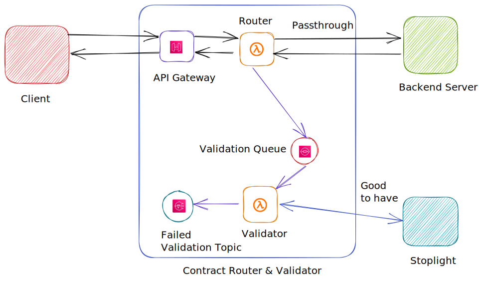

AWS Lambda Router and Validator Example
=========================================
**AWS Lambda Router and Validator** project is an example of on how to route requests via a Lambda proxy. The proxy 
lambda not only routes request to its intended target but also validates the request and its corresponding
response against a specified OpenAPI specification.

### Architecture


### Install Modules
To install all the dependencies of the project, cd into the home directory and execute the following command,
```
yarn
```
### Test
To run all unit tests, execute the following command from a terminal,
```
yarn test
```
The test report will be generated in the `test-reports` folder.

### Lint
To run lint on the whole project, execute the following command from a terminal,
```
yarn lint
```

### Deployment

In order to deploy the example, you need to run the following command:

```
sls deploy --stage "poc" --region "us-east-1"
```
